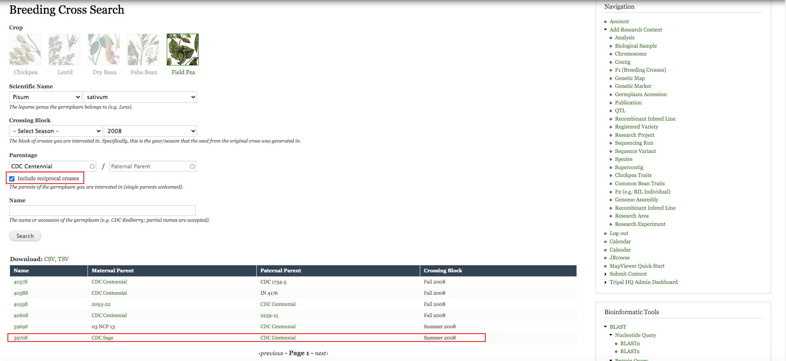

## Pea Breeging Scenario
This time, I’m a pea breeder. There is a germplasm I would like to use again this year, but I can’t recall the name of it. The only thing I can remember now is that it has CDC Centennial as one of its parents; meanwhile, this germplasm was used in 2008 for another experiment. 

