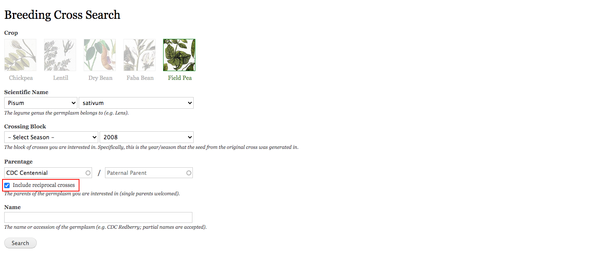
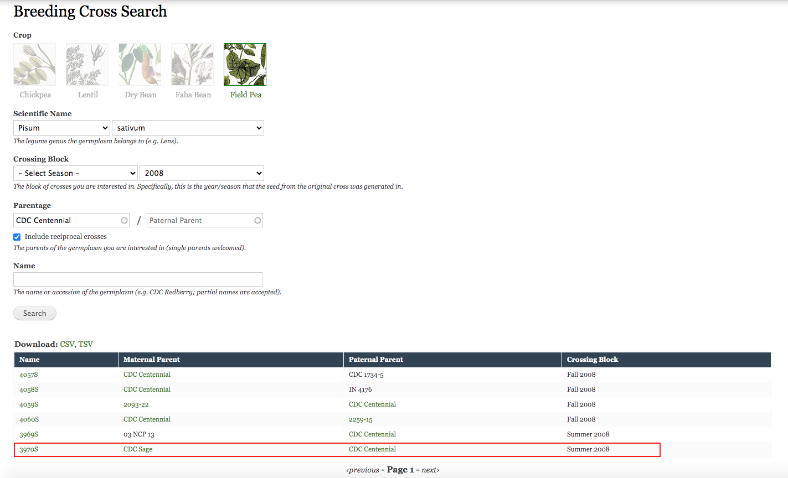

## Breeding Crosses Search---Pea Breeding Scenario

Breeding Cross Search is a powerful searching tool that allows you to look up a germplasm and its relevant information for a crossing block.
Let us say there is a *Pisum sativum* germplasm we would like to use again this year, but we cannot recall the name of it. The only thing we remember now is that it has CDC Centennial as one of its parents; meanwhile, the previous experiment was conducted in 2008.

The breeding crosses search can be very helpful in situation like this. First, we go to the Breeding Crosses Search under Germplasm, then click the image of the crop we are looking for, after that, we select the year from the relevant dropdown. For the parental information, the checkbox to include reciprocal crosses is smart enough to identify all the available crosses which have CDC Centennial as either the maternal or paternal parent. Now we see the germplasm 3970S, this is exactly what we were looking for.

